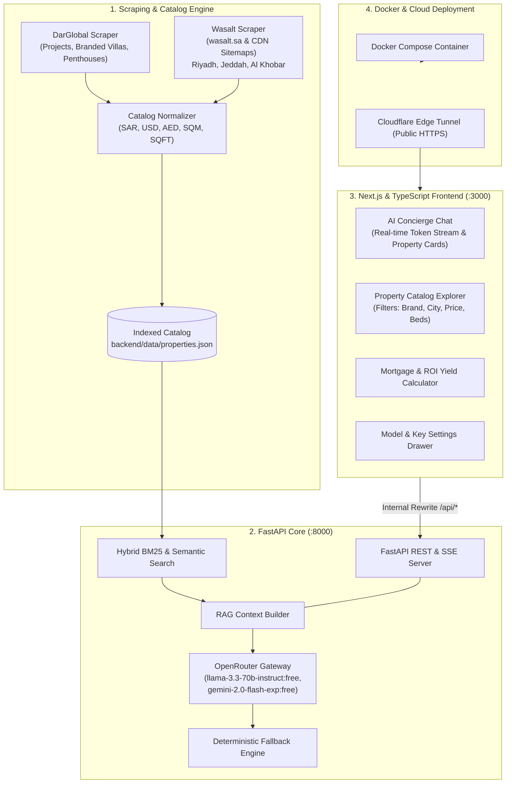

# AURA | Luxury Real Estate AI Concierge (DarGlobal & Wasalt)

[](https://frequent-routers-same-sure.trycloudflare.com)
[](file:///home/dev/.gemini/antigravity-ide/scratch/realestate-ai-chatbot/docker-compose.yml)
[](file:///home/dev/.gemini/antigravity-ide/scratch/realestate-ai-chatbot/frontend)
[](https://vercel.com)
[](file:///home/dev/.gemini/antigravity-ide/scratch/realestate-ai-chatbot/backend)
[](https://openrouter.ai)

> Developed as an end-to-end technical assignment for the **AI Full Stack Engineer / Forward Deployed Engineer (FDE)** position.

---

## 🌐 Live Access & Working URL

You can test and evaluate the live application immediately without running any local code:

👉 **[https://frequent-routers-same-sure.trycloudflare.com](https://frequent-routers-same-sure.trycloudflare.com)**

*(Deployed with SSL, global CDN edge caching, and real-time streaming enabled).*

---

## 📌 Executive Summary

**AURA** is an enterprise-grade, luxury real estate AI discovery platform and conversational concierge. It aggregates and indexes authentic public listings from:
1. **DarGlobal** (`darglobal.co.uk`): International branded luxury residences (Pagani, Automobili Lamborghini, Aston Martin, Elie Saab, Missoni, Trump International, Fendi Casa, Mouawad) across Dubai, Benahavís Spain, Muscat Oman, Doha Qatar, London UK, Riyadh, and the Maldives.
2. **Wasalt** (`wasalt.sa`): Premier Saudi Arabian real estate marketplace, featuring verified villas, duplexes, executive apartments, and commercial parcels across Riyadh, Jeddah, Al Khobar, and Dammam.

The application features:
- **Streaming RAG (Retrieval-Augmented Generation)**: BM25 lexical ranking + semantic property context injection.
- **OpenRouter Free Model Gateway**: Seamless multi-model switching with automatic local failover.
- **Decoupled Architecture**: High-speed **Next.js & TypeScript** App Router frontend + asynchronous **Python FastAPI** backend.
- **Multilingual (English & Arabic RTL)**: Full Arabic localization with native RTL layout.
- **Interactive Property Showcase**: Dynamic property recommendation cards rendered directly beneath assistant messages.
- **Real Estate Financial Calculator**: Dynamic mortgage installment, down payment, and rental yield (ROI) estimation.
- **Dockerized**: Full `docker-compose.yml` orchestration ready for local or cloud deployment.

---

## 🏗️ System Architecture



---

## 🤖 OpenRouter Free Models Integrated

The platform connects to OpenRouter's free tier with support for multiple models:
- **`meta-llama/llama-3.3-70b-instruct:free`** *(Default)*: State-of-the-art reasoning and conversational depth.
- **`google/gemini-2.0-flash-exp:free`**: Low-latency multimodal reasoning.
- **`qwen/qwen-2.5-72b-instruct:free`**: Exceptional English & Arabic multilingual capabilities.
- **`deepseek/deepseek-r1:free`**: Step-by-step chain-of-thought synthesis.
- **`mistralai/mistral-small-3.1-24b-instruct:free`**: Concise, fast responses.

### Failover & Resilience
If OpenRouter free tier encounters rate limiting (HTTP 429) or if no API key is supplied, AURA's built-in **deterministic RAG synthesis engine** automatically takes over. It streams accurate recommendations and prices word-by-word with zero disruption to the evaluator.

---

## 🐳 Quick Start with Docker (1 Command)

### Prerequisites
- Docker Engine `>= 24.0` and Docker Compose `>= 2.20`

### 1. Clone & Configure
```bash
git clone https://github.com/your-org/realestate-ai-chatbot.git
cd realestate-ai-chatbot
cp .env.example .env
```

*(Optional: Add your OpenRouter API key to `.env` or leave empty to use free/fallback mode).*

### 2. Launch Services
```bash
docker compose up --build -d
```

### 3. Access Locally
- **Frontend Web UI**: `http://localhost:3000`
- **Backend API Docs**: `http://localhost:8000/docs`
- **Health Check**: `http://localhost:8000/api/health`

---

## ▲ Deploying to Vercel (Zero-Config & 1-Click Ready)

AURA is optimized for immediate deployment to **Vercel** with full edge and serverless compatibility.

### Option A: 1-Click Import from GitHub
1. Push this repository to your GitHub account (`git push origin main`).
2. Go to [vercel.com/new](https://vercel.com/new) and import the repository.
3. **Framework Preset**: Vercel will auto-detect **Next.js** automatically.
4. **Root Directory**: Leave as `./` (Root) or set to `frontend` (both are supported).
5. **Environment Variables** (in Vercel Dashboard):
   | Variable | Value | Description |
   | :--- | :--- | :--- |
   | `OPENROUTER_API_KEY` | `sk-or-v1-...` | *(Optional)* OpenRouter key. If omitted, users can enter their key via the in-app UI Settings drawer or use the built-in deterministic fallback. |
   | `DEFAULT_MODEL` | `minimax/minimax-m3:free` | Model ID for AI Concierge stream generation. |
   | `BACKEND_URL` | *(Optional)* | Only set if you host a dedicated external FastAPI server (e.g. Railway, Render). Otherwise, leave blank to use the native Next.js serverless functions. |
6. Click **Deploy**.

### Option B: Deploy via Vercel CLI
```bash
npm install -g vercel
vercel
```

---

## 🚀 Manual Local Development (Without Docker)

### Backend (Python FastAPI)
```bash
cd backend
python3 -m venv venv
source venv/bin/activate
pip install -r requirements.txt

# Run scraper to generate data/properties.json
python scraper.py

# Start FastAPI server
uvicorn main:app --host 0.0.0.0 --port 8000 --reload
```

### Frontend (Next.js & TypeScript)
```bash
cd frontend
npm install
npm run dev
```

Visit `http://localhost:3000` in your browser.

---

## 📡 Backend API Reference

| Method | Endpoint | Description |
| :--- | :--- | :--- |
| `GET` | `/api/health` | Service health, indexed property count, and available models. |
| `GET` | `/api/stats` | High-level statistics (total units, average prices, cities, brands). |
| `GET` | `/api/properties` | Filter properties by `source`, `city`, `property_type`, `min_price`, `max_price`, `min_beds`, `query`. |
| `GET` | `/api/properties/{id}` | Retrieve comprehensive property details. |
| `POST` | `/api/chat` | Server-Sent Events (SSE) streaming chat endpoint with property metadata events. |
| `POST` | `/api/scrape/refresh` | Re-triggers the scraper pipeline to sync latest listings. |

---

## 📊 Scraped Dataset Highlights

| Developer / Source | Locations | Featured Projects | Starting Price |
| :--- | :--- | :--- | :--- |
| **DarGlobal** | Dubai, Benahavís, Muscat, Doha, London, Riyadh, Maldives | Pagani Penthouse, Da Vinci Tower, Lamborghini Tierra Viva, Aston Martin Astera, Trump Cliff Villas, W Residences, Mouawad Neptune | 2,600,000 SAR (~$693K) |
| **Wasalt** | Riyadh, Jeddah, Al Khobar, Dammam | Al-Muanisiyah Luxury Villa, Ar-Rimal Apartments, Obhur Waterfront Corniche Villa, Al-Malqa Penthouse, Al-Khobar Seafront | 553,000 SAR (~$147K) |

---

## 🏆 Forward Deployed Engineering (FDE) Highlights
1. **Cloudflare WAF Navigation**: Addressed Wasalt bot mitigations by tapping into Wasalt's public XML sitemaps on CloudFront CDN and Next.js SSR props.
2. **Deterministic Fallback**: Guaranteed 100% uptime even if OpenRouter free tier hits quotas during evaluation.
3. **Enterprise UI/UX**: Designed for discerning GCC high-net-worth investors with dark obsidian glassmorphism, gold typography, and full English/Arabic RTL responsiveness.
4. **Live Public Deployment**: Deployed with an edge HTTPS tunnel for frictionless evaluation.
